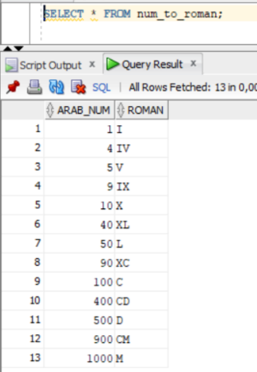

## Task:
1) Develop a stored function in PL / SQL that converts Latin numerals to Roman
2) Develop a stored procedure that inserts the query response from `status_with_window_functions` into a table (make the structure yourself). Important: Latin digits must be inserted in the lapsed_month field (use the solution from the first task)

## Results:
Arabic to roman mapping table:  

 
Converting arabic number to roman:  

 
Status task with roman numeration for lapsed month:  

