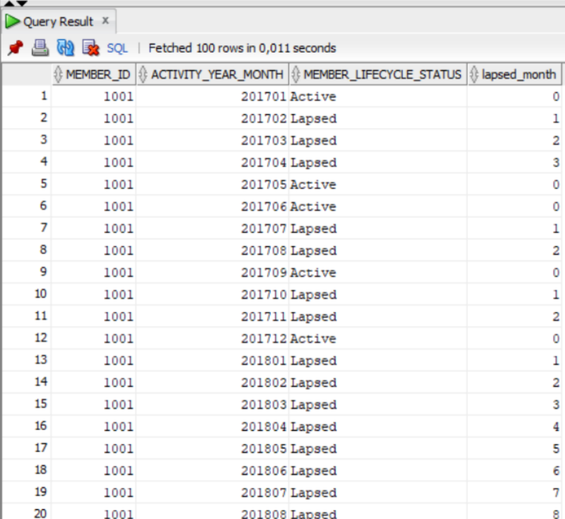

# Window functions

### Task:
Each month a member has a certain lifecycle type. The member’s status will change on a monthly
basis based on their current month's activity. The statuses are:
Active = Active in the month
Lapsed = Not active in the current month but have played in a previous month
The query should display one row per member per month, starting from the month in which they first
wager. This query should give their lifecycle status for that month, and if the member has lapsed, it
should show a rolling count of the number of months since they were last active.
The query output includes the fields:
- MEMBER_ID,
- CALENDAR_YEAR_MONTH,
- MEMBER_LIFECYCLE_STATUS,
- LAPSED_MONTH


### Script to create tables:

```
CREATE TABLE myscheme.calendar
(
calendar_date date ,
calendar_year integer ,
calendar_month_number integer ,
calendar_month_name character varying(100)
calendar_day_of_month integer ,
calendar_day_of_week integer ,
calendar_day_name character varying(100),
calendar_year_month integer
)
TABLESPACE ts_lab;

CREATE TABLE myscheme.revenue_analysis
(
activity_date date,
member_id integer,
game_id smallint,
wager_amount real,
number_of_wagers integer,
win_amount real,
activity_year_month integer,
bank_type_id smallint
)
TABLESPACE ts_lab;
```

### Solution:
First intermediate table created with `intermediate_table.sql`. Then `result.sql` will give desired result:
